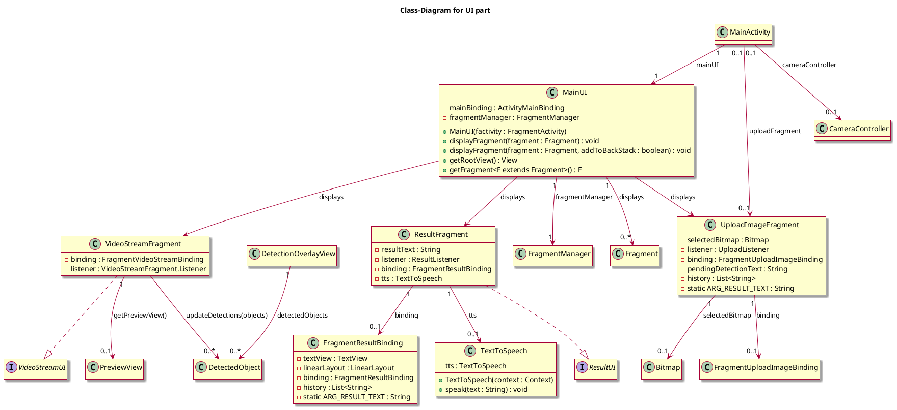
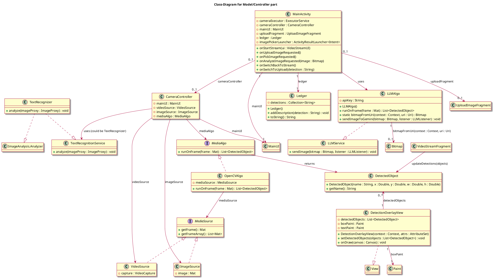

```plantuml
@startuml
skin rose
hide empty methods

title Class-Diagram for UI part


interface VideoStreamUI
interface ResultUI

class MainUI {
  - mainBinding : ActivityMainBinding
  - fragmentManager : FragmentManager
  + MainUI(factivity : FragmentActivity)
  + displayFragment(fragment : Fragment) : void
  + displayFragment(fragment : Fragment, addToBackStack : boolean) : void
  + getRootView() : View
  + getFragment<F extends Fragment>() : F
}

class VideoStreamFragment {
- binding : FragmentVideoStreamBinding
- listener : VideoStreamFragment.Listener
}

class UploadImageFragment {
- selectedBitmap : Bitmap
- listener : UploadListener
- binding : FragmentUploadImageBinding
- pendingDetectionText : String
- history : List<String>
- static ARG_RESULT_TEXT : String
}

class FragmentResultBinding {
- textView : TextView
- linearLayout : LinearLayout
- binding : FragmentResultBinding
- history : List<String>
- static ARG_RESULT_TEXT : String
}

class ResultFragment {
- resultText : String
- listener : ResultListener
- binding : FragmentResultBinding
- tts : TextToSpeech
}

class TextToSpeech {
- tts : TextToSpeech
+ TextToSpeech(context : Context)
+ speak(text : String) : void
}

MainActivity "1" --> "1" MainUI : mainUI
MainActivity "0..1" --> "0..1" CameraController : cameraController
MainActivity "0..1" --> "0..1" UploadImageFragment : uploadFragment

MainUI "1" --> "1" FragmentManager : fragmentManager
MainUI "1" --> "0..*" Fragment : displays
UploadImageFragment "1" --> "0..1" FragmentUploadImageBinding : binding
UploadImageFragment "1" --> "0..1" Bitmap : selectedBitmap

ResultFragment "1" --> "0..1" FragmentResultBinding : binding
ResultFragment "1" --> "0..1" TextToSpeech : tts

VideoStreamFragment "1" --> "0..1" PreviewView : getPreviewView()

VideoStreamFragment ..|> VideoStreamUI
ResultFragment ..|> ResultUI

VideoStreamFragment --> "0..*" DetectedObject : updateDetections(objects)
DetectionOverlayView "1" --> "0..*" DetectedObject : detectedObjects


MainUI --> UploadImageFragment : displays
MainUI --> VideoStreamFragment : displays
MainUI --> ResultFragment : displays


@enduml
```

```plantuml 
@startuml
title Class-Diagram for Model/Controller part
set separator none
skin rose
hide empty methods


' Interfaces
interface MediaSource {
+ getFrame() : Mat
+ getFrameArray() : List<Mat>
}

interface MediaAlgo {
+ runOnFrame(frame : Mat) : List<DetectedObject>
}

' Classes
class CameraController {
- mainUI : MainUI
- videoSource : VideoSource
- imageSource : ImageSource
- mediaAlgo : MediaAlgo
}

class DetectionOverlayView {
- detectedObjects : List<DetectedObject>
- boxPaint : Paint
- textPaint : Paint
+ DetectionOverlayView(context : Context, attrs : AttributeSet)
+ setDetectedObjects(objects : List<DetectedObject>) : void
+ onDraw(canvas : Canvas) : void
}

class VideoSource {
- capture : VideoCapture
}

class ImageSource {
- image : Mat
}

class OpenCVAlgo {
- mediaSource : MediaSource
+ runOnFrame(frame : Mat) : List<DetectedObject>
}

class LLMAlgo {
- apiKey : String
+ LLMAlgo()
+ runOnFrame(frame : Mat) : List<DetectedObject>
+ static bitmapFromUri(context : Context, uri : Uri) : Bitmap
+ sendImageToGemini(bitmap : Bitmap, listener : LLMListener) : void
}

class TextRecognizer {
+ analyze(imageProxy : ImageProxy) : void
}

class LLMService {
+ sendImage(bitmap : Bitmap, listener : LLMListener) : void
}

class TextRecognitionService {
+ analyze(imageProxy : ImageProxy) : void
}

class DetectedObject {
+ DetectedObject(name : String, x : Double, y : Double, w : Double, h : Double)
+ getName() : String
}

class Ledger {
    - detections : Collection<String>
    
    + Ledger()
    + addDescription(detection : String) : void
    + toString() : String
}

class MainActivity {
  - cameraExecutor : ExecutorService
  - cameraController : CameraController
  - mainUI : MainUI
  - uploadFragment : UploadImageFragment
  - ledger : Ledger
  - imagePickerLauncher : ActivityResultLauncher<Intent>
  
  + onStartStream(ui : VideoStreamUI)
  + onUploadImageRequested()
  + onPickImageRequested()
  + onAnalyzeImageRequested(image : Bitmap)
  + onSwitchBackToStream()
  + onSwitchToUpload(detection : String)
}


' Inheritance / Implementation
MediaSource <|.. ImageSource
MediaSource <|.. VideoSource
MediaAlgo <|.. OpenCVAlgo
DetectionOverlayView ..|> View
TextRecognizer ..|> ImageAnalysis.Analyzer
LLMAlgo ..|> LLMService
TextRecognizer ..|> TextRecognitionService

' Associations / "has-object-of-type"
CameraController --> MediaAlgo : mediaAlgo
OpenCVAlgo --> MediaSource : mediaSource
CameraController --> MainUI : mainUI
CameraController --> ImageSource : imageSource
CameraController --> VideoSource : videoSource
MainActivity --> LLMAlgo : uses
MainActivity "1" --> "1" MainUI : mainUI
MainActivity "0..1" --> "0..1" CameraController : cameraController
MainActivity "0..1" --> "0..1" UploadImageFragment : uploadFragment
MainActivity "1" --> "1" Ledger : ledger
CameraController --> TextRecognitionService : uses (could be TextRecognizer)

DetectionOverlayView "1" -u-> "0..*" DetectedObject : detectedObjects
DetectionOverlayView "1" --> "1" Paint : boxPaint

LLMAlgo "1" --> "0..1" Bitmap : bitmapFromUri(context : Context, uri : Uri)
MediaAlgo --> DetectedObject : returns
VideoStreamFragment --> DetectedObject : updateDetections(objects)

@enduml
```