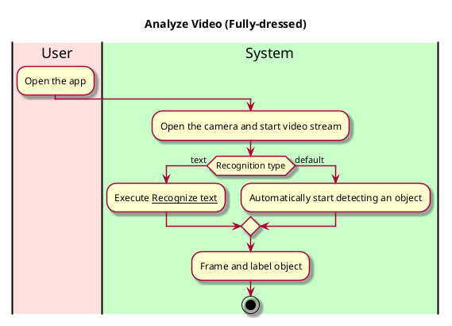
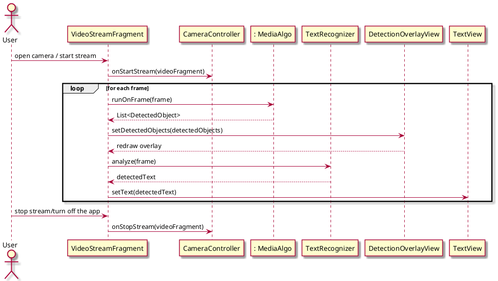

# Recognize Objects in Video

## 1. Primary actor and goals

__User__: Wants to recognize what objects are in the video stream from the camera and receive real-time audio descriptions.

## 2. Preconditions

What must be true prior to the start of the use case.

* We are not going to have a log-in system for the purpose of easy-use and quick-access of the app.
* The camera is working and is granted permission.
* There is enough lighting and the objects are visible and not obscured.

## 3. Post-conditions

What must be true upon successful completion of the use case.

* Object is recognized.
* The object is described in text.
* The app is open and running.
* There is a text-to-speech function that reads out the description.

## 4. Workflow

for _analyze-video_:

## 5. Sequence Diagram

