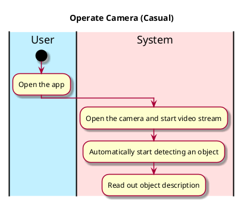

# Analyze video

## 1. Primary actor and goals
__User__: Wants a fast responding speech text that is able to recognize what object is on video stream from the camera

## 2. Other stakeholders and their goals

* __User__: Wants a friendly user interface. Wants a fast responding and accurate description of an object on the screen.

## 2. Preconditions

What must be true prior to the start of the use case.

* We are not going to have a log-in system for the purpose of an easy-use and quick-access of the app
* The camera is working and is able to be accessed

## 3. Post-conditions

What must be true upon successful completion of the use case.

* Object is recognized.
* The object is described in text.
* There is a text-to-speech function that reads out the description.

## 4. Workflow

The sequence of steps involved in the execution of the use case, in the form of one or more activity diagrams (please feel free to decompose into multiple diagrams for readability).

The workflow can be specified at different levels of detail:

* __Brief__: main success scenario only;
* __Casual__: most common scenarios and variations;
* __Fully-dressed__: all scenarios and variations.

Please be sure indicate what level of detail the workflow you include represents.

For example, for _analyze-video_:

