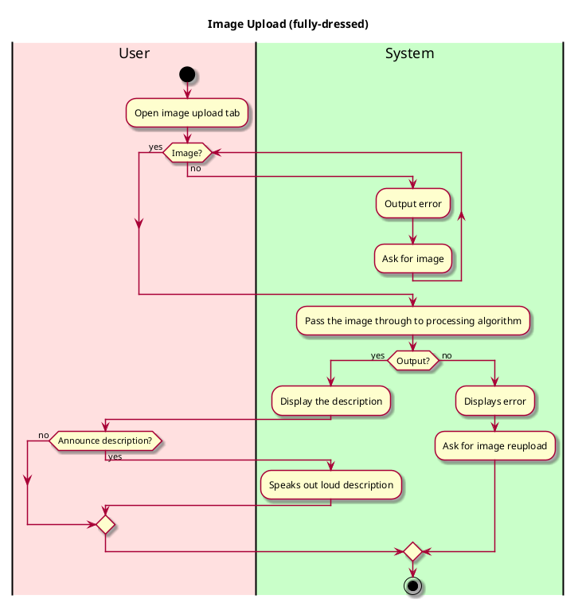

# Process Image Upload and generate Description

## 1. Primary actor and goals
* __User__: Wants to process a photo to acquire its description and detect the focused object within it. 

## 2. Other stakeholders and their goals

* __User__: Wants a simple interface for image upload. Wants a fast responding and accurate description of objects.

## 3. Preconditions

What must be true prior to the start of the use case.

* We are not going to have a log-in system for the purpose of an easy-use and quick-access of the app
* User has a clear image prepared.
* The app is open and running.
* App is granted permission to access the gallery and the device is connected to the Internet.

## 4. Post-conditions

What must be true upon successful completion of the use case.

* Object is recognized.
* Image is processed and ChatGPT describes the image closely in text.
* App displays text-to-speech function that reads out the description.


## 5. Workflow

## 5. Sequence Diagram
```plantuml
@startuml
skin rose
hide footbox

actor User

participant "UI" as ui
participant "Controller" as controller
participant ": ImageSource" as process
participant ": OpenCVAlgo" as opencv
participant ": LLMAlgo" as gpt

User -> ui : select / upload image
ui -> controller : pass image file
controller -> process : load image

process -> opencv : pre-process image
opencv -> opencv : run recognition algorithm
opencv --> controller : return detected objects

controller -> gpt : send object data for description
gpt --> controller : return image description

controller -> ui : display results (objects + description)

@enduml


