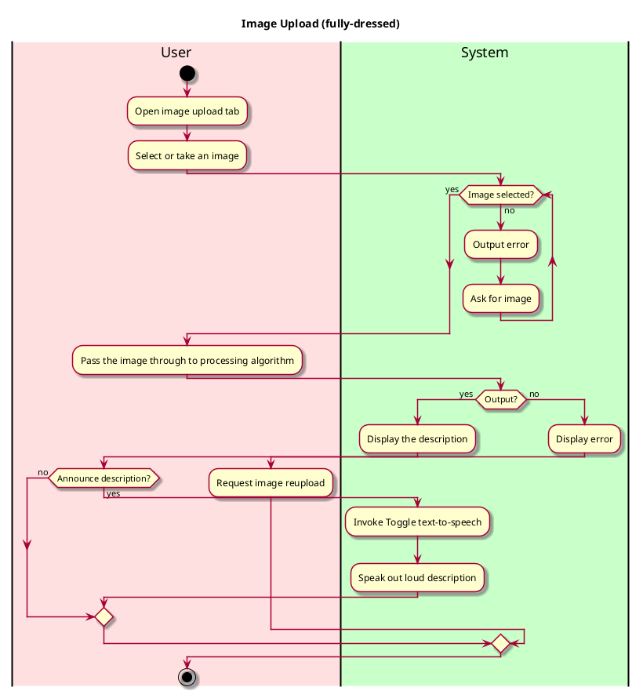

you# Describe Uploaded Image

## 1. Primary actor and goals

* __User__: Wants to upload a photo and receive an accurate description of the objects within it.

## 2. Other stakeholders and their goals

* __User__: Wants a simple interface for image upload. Wants a fast responding and accurate description of objects.

## 3. Preconditions

What must be true prior to the start of the use case.

* We are not going to have a log-in system for the purpose of easy-use and quick-access of the app.
* User has a clear image prepared or access to the device's photo gallery.
* The app is open and running.
* App is granted permission to access the gallery and the device is connected to the Internet.

## 4. Post-conditions

What must be true upon successful completion of the use case.

* Object is recognized.
* Image is processed and ChatGPT describes the image closely in text.
* App displays text-to-speech function that reads out the description.

## 5. Workflow



## 6. Sequence Diagram

```plantuml
@startuml
skin rose
hide footbox

actor User

participant "UI" as ui
participant "Controller" as controller
participant ": ImageSource" as imagesource
participant ": MediaAlgo" as mediaAlgo
participant ": LLMAlgo" as llm

ui -> User : present image selection form
User -> ui : select / upload image
ui -> controller : passImage(file)
controller -> imagesource : loadImage(file)

imagesource --> controller : return preprocessed image
controller -> mediaAlgo : runAlgorithm(image)
mediaAlgo --> controller : return detected objects
controller -> llm : generateDescription(objects)
llm --> controller : return description

controller -> ui : displayResults(objects, description)
ui --> User : show results
@enduml


