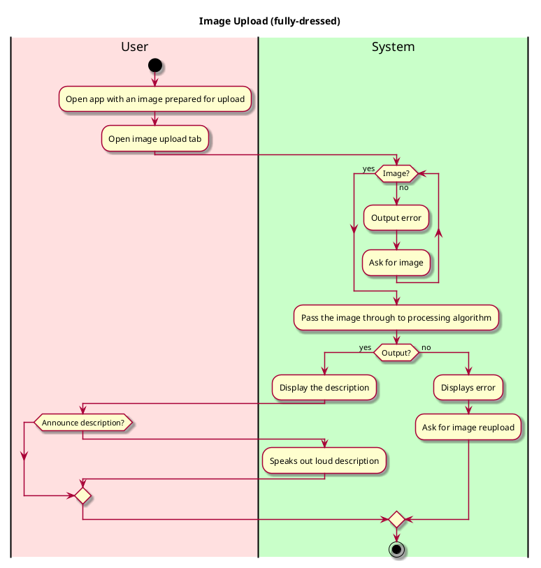

# Process Image Upload

## 1. Primary actor and goals
* __User__: Wants to process a photo to acquire its description and detect the focused object within it. 

## 2. Other stakeholders and their goals

* __User__: Wants a simple interface for image upload. Wants a fast responding and accurate description of objects.

## 3. Preconditions

What must be true prior to the start of the use case.

* We are not going to have a log-in system for the purpose of an easy-use and quick-access of the app
* User has a clear image prepared

## 4. Post-conditions

What must be true upon successful completion of the use case.

* Object is recognized.
* Image is processed and ChatGPT describes the image closely in text.
* App displays text-to-speech function that reads out the description.

## 5. Workflow

The sequence of steps involved in the execution of the use case, in the form of one or more activity diagrams (please feel free to decompose into multiple diagrams for readability).

The workflow can be specified at different levels of detail:

* __Brief__: main success scenario only;
* __Casual__: most common scenarios and variations;
* __Fully-dressed__: all scenarios and variations.

