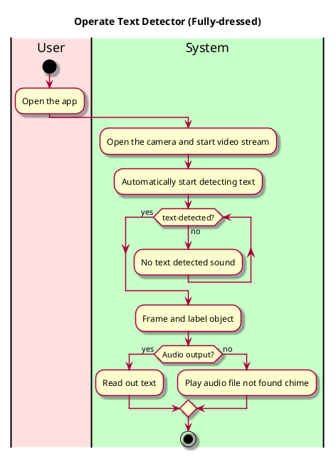

# Real-time Text Recognition

## 1. Primary actor and goals
__User__: Wants a fast responding speech text that is able to recognize text on video stream from the camera

## 2. Other stakeholders and their goals

* __User__: Wants a friendly user interface. Wants a fast responding and accurate description of an object on the screen.

## 2. Preconditions

What must be true prior to the start of the use case.

* We are not going to have a log-in system for the purpose of an easy-use and quick-access of the app
* The camera is working and is granted permission.
* There's enough lighting and the text is visible and clear.
* The app is open and running.

## 3. Post-conditions

What must be true upon successful completion of the use case.

* Text is recognized.
* There is a text-to-speech function that reads out the text.

## 4. Workflow

for _recognize-textt_:

