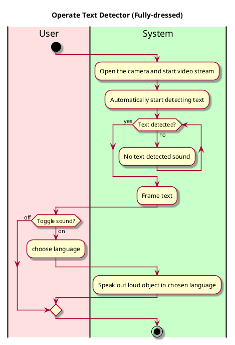

# Recognize Text in Video

## 1. Primary actor and goals
__User__: Wants to recognize text in the video stream from the camera and receive real-time audio descriptions of the text.

## 2. Other stakeholders and their goals

* __User__: Wants a friendly user interface. Wants fast responding and accurate text recognition.

## 3. Preconditions

What must be true prior to the start of the use case.

* We are not going to have a log-in system for the purpose of easy-use and quick-access of the app.
* The camera is working and is granted permission.
* There is enough lighting and the text is visible and clear.

## 3. Post-conditions

What must be true upon successful completion of the use case.

* Text is recognized.
* There is a text-to-speech function that reads out the text.
* an option to choose the language which the language is read out in. 

## 4. Workflow

for _recognize-text_:

