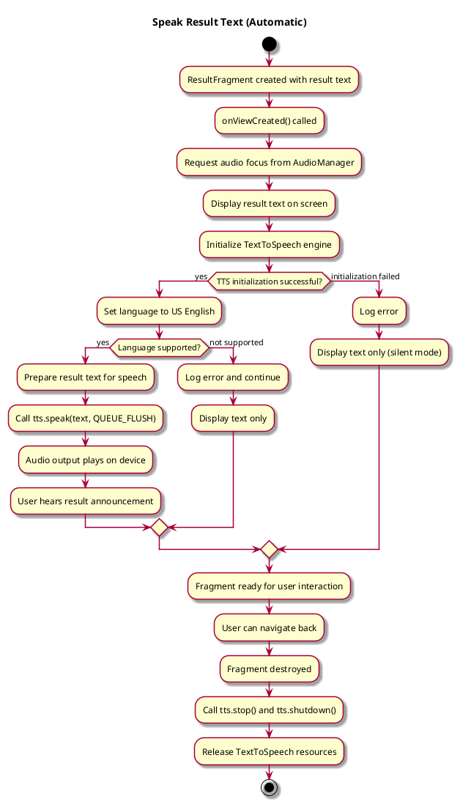
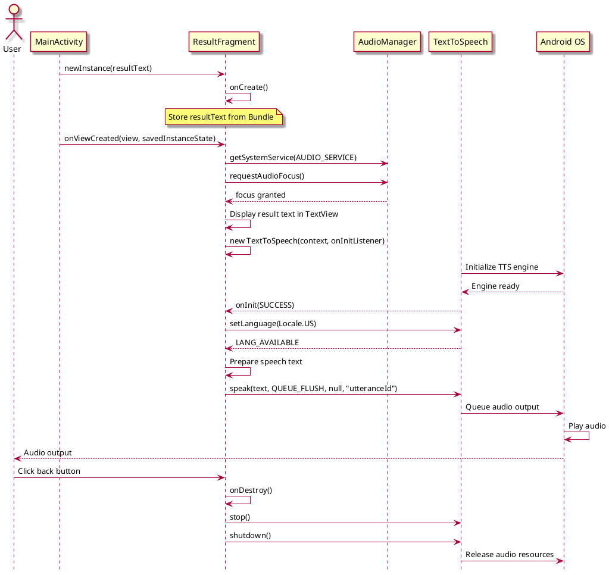

# Speak Result Text

## 1. Primary actor and goals

__User__: Receives automatic audio announcement of detection results for enhanced accessibility.

## 2. Other stakeholders and their goals

* __Visually-impaired user__: Relies on audio feedback to understand detection results without visual interface.
* __Application__: Automatically provides audio output on result screen to ensure accessibility compliance.

## 3. Preconditions

What must be true prior to the start of the use case.

* Detection analysis has completed (object detection or text recognition).
* ResultFragment is displayed with result text.
* Device has TextToSpeech engine available (standard Android feature).
* System audio output is not muted (controlled by device settings).

## 4. Post-conditions

What must be true upon successful completion of the use case.

* Result text has been spoken aloud automatically.
* User hears the result announcement in English (Locale.US).
* TextToSpeech resources are properly released when fragment is destroyed.

## 5. Workflow

## 6. Sequence Diagram

## 7. Special Requirements

- **Accessibility**: Automatic speech output without user intervention ensures visually-impaired users receive results
- **Performance**: TTS initialization happens in background via callback; does not block UI thread
- **Resource Management**: TextToSpeech must be properly shut down in onDestroy() to prevent memory leaks
- **Language**: Currently hardcoded to Locale.US English (no multi-language support)
- **Audio Focus**: Requests audio focus to manage system audio policy (music pause, etc.)
- **Error Resilience**: Handles TTS engine unavailability gracefully by falling back to text-only display
- **Device Compatibility**: Relies on Android OS standard TextToSpeech (available on all devices)
