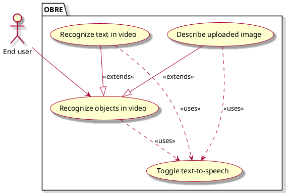

# OBRE System - Vision document

## 1. Introduction

We envision an **Object Recognition Application** as an accessibility tool for low-vision and visually-impaired users. The app enables users to recognize objects from video streams and images, and to read text in their environment, all through real-time audio feedback. It provides an out-of-the-box experience that requires no login and prioritizes ease of use.

## 2. Business case

Our software addresses the visually-impaired community's needs:
1. It can provide immediate access without login requirements, creating a smooth
and immediate user experience.
2. It integrates text-to-speech capabilities that allow users to become
aware of their surroundings just through pointing their camera at their
environment.

## 3. Key functionality
- Video feed capture with audible notification using Text-to-speech.
- Text recognition with Text-to-speech capability.
- Image upload for recognition through OpenAI's API.

## 4. Stakeholder goals summary
- **Users**: Recognize objects in live video streams and identify what is around them. Process uploaded images to receive accurate descriptions. Read text in their environment in real time. All features should provide audio feedback via text-to-speech.

## Use case diagram

