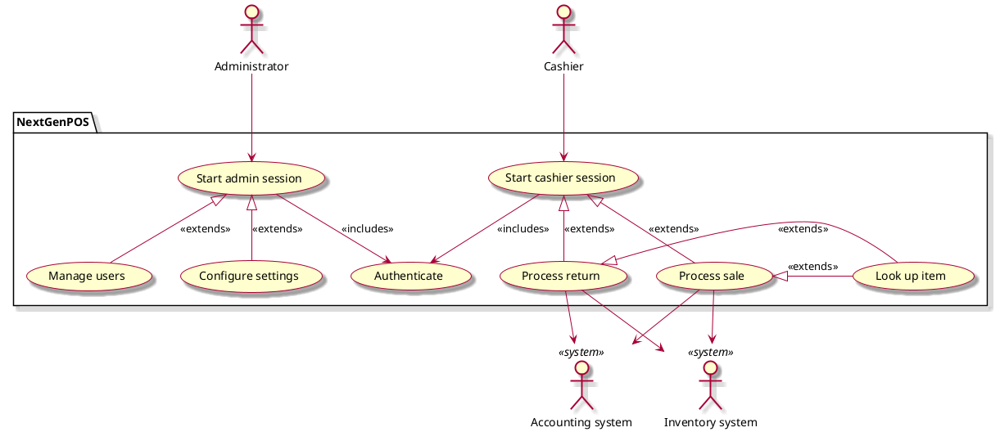

# NextGen Point Of Sale system - Vision document

## 1. Introduction

We envision a robust Point-Of-Sale (POS) application, NextGen POS, with the flexibility to support multiple terminal and user interface mechanisms, and integrate with multiple third- party support systems.

## 2. Business case
Our POS software addresses customer needs that other products do not:
1. It can continue processing sales even when external services fail.
2. It integrates with accounting and inventory systems to simplify stocking logistics.

## 3. Key functionality
- Sales capture and auditing.
- Multiple payment method support (credit, debit, check, cash).
- System administration for users, security, discount rules, etc.
- Real time inventory updating through 3rd party system connection.
- Automatic offline sales processing support when external systems fail.

## 4. Stakeholder goals summary
- **Cashier**: process sales, handle returns, cash in, cash out
- **Administrator**: manage users, configure system
- **Sales activity system**: analyze sales data
- **Tax agency**: collect correct amount of tax for each sale

## Use case diagram

