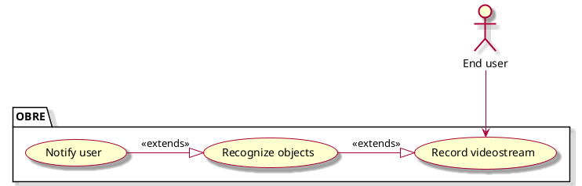

# NextGen Point Of Sale system - Vision document

## 1. Introduction

We envision an Object Recognition Application that provides real-time notification from the video feed with 
a user-friendly and out-of-the-box experience.

## 2. Business case

Our software addresses the visually-impaired community's needs:
1. It can provide immediate access without login requirements, creating a smooth
and immediate user experience.
2. It integrates text-to-speech capabilities that allow users to become
aware of their surroundings just through pointing their camera at their
environment.

## 3. Key functionality
- Video feed capture 
- Text-to-speech capability
- Simple and visually-impaired-friendly User Interface.

## 4. Stakeholder goals summary
- The stakeholder wants an accurate description of the object

## Use case diagram

